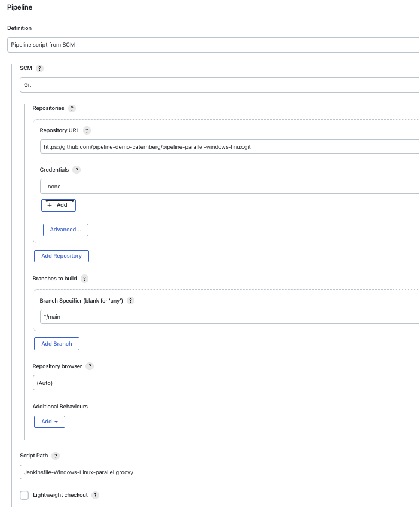

# Jenkins pipeline-parallel-windows-linux
Jenkins parallel Pipeline example with windows and linux nodepools on GKE 1.24


# Create a cluster 

* ` --enable-ip-alias`is required for windows
* Windows requires some resources on the default nodepool. Ensure to have enough capacity on the default nodepool

```
REGION=us-east1 && MACHINE_TYPE=n1-standard-8 #n1-standard-2 might work as well
MIN_NODES=1 && MAX_NODES=3

gcloud container clusters create $CLUSTER_NAME \
    --enable-ip-alias --zone $ZONE \
    --machine-type $MACHINE_TYPE --enable-autoscaling \
    --num-nodes 1 --max-nodes $MAX_NODES \
    --min-nodes $MIN_NODES
```

# Create Windows nodepool

* In GKE version 1.24 and later, Docker-based node image types are not supported. In GKE version 1.23, you also cannot create new node pools with Docker node image types. You must migrate to a containerd node image type.
 So conatinerd `--image-type=WINDOWS_LTSC_CONTAINERD` is required for 1.24
* `enable-autoscaling` is required 
* ensure the `machine-type` is sufficient
  * `n1-standard-16` (might work with `n1-standard-8` as well)

```
gcloud container node-pools create windows \
    --cluster=$CLUSTER_NAME \
    --enable-autorepair \
    --local-ssd-count=4 \
    --image-type=WINDOWS_LTSC_CONTAINERD \
    --no-enable-autoupgrade \
    --enable-autoscaling \
    --num-nodes=2 \
    --min-nodes=1 \
    --max-nodes=3 \
    --machine-type=n2-standard-16
    --zone=$ZONE
```

# Create Linux nodepool

* `enable-autoscaling` is required
* ensure the `machine-type` is sufficient
    * `n1-standard-16` (might work with `n1-standard-8` or smaller as well, depending on the pod resource limits)

```

gcloud container node-pools create linux \
--cluster $CLUSTER_NAME \
--machine-type=n1-standard-16 \
--enable-autoupgrade \
--enable-autoscaling \
--num-nodes=1 \
--min-nodes=1 \
--max-nodes=2
--zone=$ZONE
```

# Verfiy the cluster nodepools 

```
gcloud container node-pools list --cluster  $CLUSTER_NAME --format json |  jq -r  '.[].name'
default-pool
windows
linux
```

# Install Jenkins OSS  (or better CloudBees CI)  and create the Pipeline job

* Create a Pipeline
* Set up Pipeline from SCM/GIT (this repo)
* set `branch` to `*/main`
* Set `Script Path` to `Jenkinsfile-Windows-Linux-parallel.groovy`
* 
* Do NOT overwrite the jnlp image global like this. 
  * `org.csanchez.jenkins.plugins.kubernetes.pipeline.PodTemplateStepExecution.defaultImage=jenkins/inbound-agent:windowsservercore-ltsc2019`
  * Windows jnlp should be overwritten instead inside the windows podtemplate (see [pods/windows.yaml](pods/windows.yaml))
* Start the Pipeline, watch the log 
* 

* ensure the right nodeselector is configured in podtemplates (see pod yaml files in directory `pods`)
```
         nodeSelector:
            kubernetes.io/os: linux
      or
          nodeSelector:
            kubernetes.io/os: windows
```
* NOTE: the `Jenkinsfile-Windows-Linux-parallel.groovy` Pipeline will never stop because it has infinity loops for showing purposes implemented. You have to stop the Pipeline manually.
 * see `Jenkinsfile-Windows-Linux-parallel.groovy` implementation for details 

# Links 

* https://www.jenkins.io/blog/2017/09/25/declarative-1/
* https://cloud.google.com/kubernetes-engine/docs/how-to/creating-a-cluster-windows
* https://docs.cloudbees.com/docs/cloudbees-ci/latest/cloud-admin-guide/agents#_running_cloudbees_ci_build_agents_in_windows_containers
* https://www.cloudbees.com/blog/cloudbees-ci-support-windows-containers-google-kubernetes-engine-gke
* https://cloud.google.com/kubernetes-engine/docs/how-to/node-auto-provisioning#custom_machine_family
* https://stackoverflow.com/questions/71140610/can-t-scale-up-nodes-because-node-auto-provisioning-is-disabled-which-prevents
* https://kubernetes.io/docs/tasks/debug/debug-application/debug-running-pod/
* https://gcpinstances.doit-intl.com/
